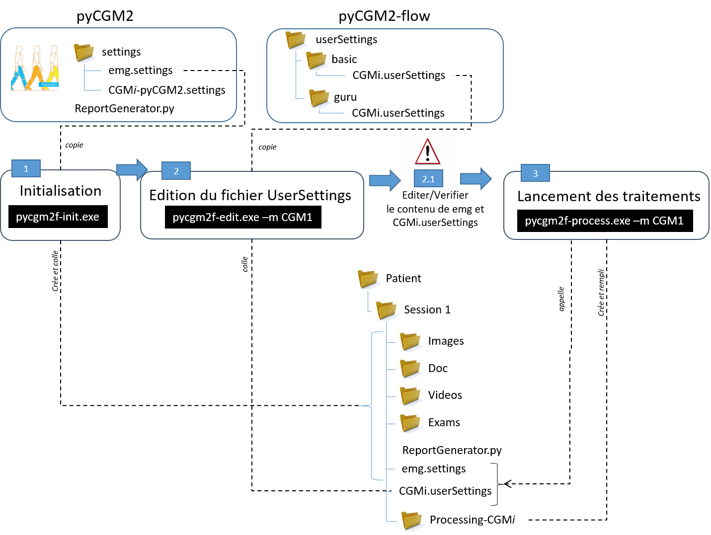

*******************
Version Francaise
*******************

.. contents::
    :depth: 3

**Flow** est une extension de **pyCGM2** permettant de travailler avec les differents
Conventional Gait models à partir **d'UN fichier de configuration**.

Un objectif secondaire de *flow* est d'avoir une meilleure visibilité et donc
un meilleur suivi du traitement numerique effectué sur les données de marche.

Installation
===============

Voici la procedure d installation complete de flow, intégrant  l installation de
python et du package pyCGM2.

.. warning::

    Pour ne pas venir modifier votre eventuelle installation python. Je recommande
    fortement de travailler a partir **d'environnement virtuel**

Installation de python
------------------------

1. installer miniconda [Python3 64bit](https://www.anaconda.com/distribution/).

Pycgm2 et flow sont uniquement compatible en python 2.7 32bits.
Il va donc falloir configurer l'environnement virtuel en fonction

2. ouvrir la console *anaconda prompt* et taper:

.. code::

  set CONDA_FORCE_32BIT=1
  conda create --nname pycgm2 python=2.7
  activate pycgm2
  set CONDA_FORCE_32BIT=

L'environnement virtuel *pycgm2* est desormais activé.

.. note::

    A chaque ouverture de la console anaconda, il faudra retaper

    .. code::

      activate pycgm2

    pour activer l environnement pycgm2

Installer pyCGM2
------------------------

1. cloner la branche [developpment](https://github.com/pyCGM2/pyCGM2/tree/development) de pyCGM2 avec un logiciel de gestion de version  ( github desktop, sourcetree...)

2. ouvrir une console conda prompt

- activer l environnement virtuel *pycgm2*
- se rendre dans le repertoire local ou les code du package pycgm2 ont été deposés.

3. taper la commande

.. code::

    python setup.py develop

Installer pyCGM2-flow
------------------------

La demarche est identique mais pointe sur le depot github: flow

1. cloner la branche [master](https://github.com/pyCGM2/flow) de pyCGM2-flow avec un logiciel de gestion de version  ( github desktop, sourcetree...)

2. ouvrir une console conda prompt

-  activer l environnement virtuel *pycgm2*
-  se rendre dans le repertoire local ou les codes du package pycgm2-flow ont été deposés.

3. taper la commande

.. code::

    python setup.py develop

.. note::

    L'argument *develop* permet de travailler directement sur les depots locaux de pyCGM2 et flow.
    Cela permet d'etre au plus pres des developpements effectués sur les 2 packages sans avoir a re-telecharger le package.

Le worklow
===============

Cette image decrit le flux de traitement des données.
Il faut noter pour chaque étape : l'appel a de *commande executable (.exe)* ainsi que la manipulation des fichiers *settings* de pycgm2 et flow

Le detail de chaque etape va etre developé dans les parties ci-dessous.

Les fichiers settings
============================

Le fichier **CGMi.userSettings** ( i pour  1,11, 21,...25) est le fichier de configuration principal. Il est important de bien le maitriser ( voir :ref:`userSettings`) .

*userSettings* appartient au package flow. Il se coordonne avec 2 autres settings appartenant a pycgm2:

- emg.settings : dans lequel est defini la configuration des voies emg

- CGMi-pyCGM2.settings : dans lequel est regroupé l ensemble des parametres par defaut des modeles de marche. Il s agit ici de settings **EXPERT**

Pour plus de renseignements sur ces 2 settings, voir la documentation de `pyCGM2
<https://pycgm2.github.io/Documentation/html/settings.html>`_.

Usage
============================

Dans un premier temps :

- ouvrez une console anaconda prompt
- activer l environnement pyCGM2
- placer vous a l endroit ou se trouve les données ( fichier c3d) de la session de marche a traiter

Conformement au workflow precedent, le traitement va s effectuer en 3 étapes

Etape 1 : Initialisation
--------------------------

Cette etape *prépare* le dossier de données.

Dans la console, taper :

.. code::

    pycgm2f-init.exe

Des repertoires (Images, Videos...) seront crées pour reunir des fichiers exterieurs.
Cette  commande copie-colle le fichier  *emg.setting* e dans le dosier de données.

.. note::

    quelques mots sur le script python "reportgenerator.py" copié dans le repertoire de données.
    Ce script est *Experimental* et vise a generer un rapport au format word.
    Il doit etre editer et lancer a la suite de l'etape 3
    Ce script s'appuie sur les fonctions de haut niveau appartenant au repertoire *Lib* de *pyCGM2*.
    Il  vient manipuler les fichiers * *-pyCGM2.analysis*  et construire les panels de courbe

Pour plus d info, sur les differents arguments d entrée, voir le detail de la commande :ref:`initCommand`

Etape 2 : Edition du fichier userSettings
-----------------------------------------------

Cette etape doit mener a *l'edition* du fichier userSettings.

Dans la console, taper :

.. code::

    pycgm2f-edit.exe -m CGM1

Cette commande a comme argument d'entrée ('-m') le modele (ici CGM1).
Cette commande copie-colle le fichier *CGM1.userSettings* dans le repertoire de données.

.. warning::

    **ATTENTION : Vous devez maitenant EDITER les fichiers *userSettings* et *emg.settings* collés dans la session avec votre editeur de texte**

Pour verifier que vous respecter la syntaxe yaml, utiliser l'outil en ligne `yamlLint
<http://www.yamllint.com/>`_.

Pour plus d info, sur les differents arguments d entrée, voir le detail de la commande :ref:`editCommand`

Etape 3 : lancement des traitements
-----------------------------------------------

Cette etape  *lance le traitement*.

Dans la console, taper :

.. code::

    pycgm2f-process.exe -m CGM1

Cette commande a comme argument d'entrée ('-m') le modele (ici CGM1).
Cette commande va utiliser les informations contenues dans *userSettings*.
Elle va créer un repertoire (ici *Processing-CGM1*) dans le dossier de données ou les fichier de sortie du traitement seront entreposés

Pour plus d info, sur les differents arguments d entrée, voir le detail de la commande :ref:`processCommand`

.. warning::

    **Les acquisitions (c3d) doivent contenir les evenements du cycle de marche**.
    Il n'y a pas d'algorithme de detection dans la commande traitement.

Dans le repertoire de sortie *Processing-CGM1*, on trouvera pour chaque *condition* stipulée dans *userSettings*:

- *cleConditionID -advanced.xls* : fichier excel regroupant l'ensemble des données cinematique/dynamique/emg traité.

- *cleConditionID -Benedetti-dataframe.xls* : fichier excel regroupant les valeurs numeriques des parametres recommandées dans l'article de Benedetti et al (1998) .

- *cleConditionID -EMG-dataframe.xls* : fichier excel regroupant les valeurs numeriques des integrations du signal EMG sur les differentes phases du cycle de marche .

- *cleConditionID -pyCGM2.analysis* : sauvegarde de l instance "analysis" construite par pyCGM2 pour la condition donnée.
  C est ce fichier qui est appelé dans mon script *ReportGenerator.py* pour construire le rapport. (Pour les utilisateurs Matlab, c est un sorte de fichier mat)

- *AQM-exam.info* : fichier au format json reunissant Données et les userSettings.

Recapitulatif - exemple
---------------------------

Voici un exemple de traitement de données avec le CGM23.

Considerons les données stockées dans 'c:\\mes données\\Hannibal Lecter\\Session 1'.
Toutes les c3d ont été labelisés et les evenements du cycle de marche identifiés.

Le traitement s'effectuera de la maniere suivante:

1. ouvrir anaconda prompt puis taper:

.. code::

    activate pycgm2
    cd c:\\mes données\\Hannibal Lecter\\Session 1
    pycgm2f-init.exe
    pycgm2f-edit.exe -m CGM23

2. Editer le contenu de *CGM23.userSettings* et *emg.settings* puis taper :

.. code::

    pycgm2f-process.exe -m CGM23 -p

Je rajoute ici l'argument "-p" afin de pouvoir visualiser les tracés (voir :ref:`processCommand`)

Usage avancée
============================

L usage avancée est utile lorsque les spécicités de votre examen sont differentes
des celles attendues pour les CGMi. Un exemple concret est typiquement l emploi de noms de marqueurs differents (Left-ASI a la place de LASI).
Il peut aussi s'agir de modifier le comportemnt standard du CGM, par exemple :

- en desactivant l'optimisation cinematique inverse pour les CGM 2.2+
- en forcant les positions de centre articulaire de hanche ( valable pour les CGM2i )
- en changeant le referentiel de projection des moments articulaires

Toutes ses informations sont possibles et peuvent s effectuer en modifiant les fichiers de settings expert *CGMi-pyCGM2.settings* appartenant au package **pycgm2**

Ainsi à l étape *Init*, il faudra preciser que vous souhaitez importer les settings expert dans le repertoire de données.
Il faudra donc taper, pour le CGM23 par exemple :

.. code::

    pycgm2f-init.exe --expert -m CGM2_3

Le fichier *CGM23-pyCGM2.settings* sera importé et vous pourrez le modifier à votre guise.

Vous pouvez ensuite poursivre les etapes de traitement en tapant :

.. code::

    pycgm2f-edit.exe -m CGM23
    pycgm2f-process.exe -m CGM23

Lors de l étape process, le fichier expert sera automatiquement detecté.
Dans le cas ou vous souhaitez utiliser un fichier expert renommé, alors il faudra forcer son utilisation en tapant

.. code::

    pycgm2f-process.exe -m CGM23 --expert "monFichierExpert-pycgm2.settings"

.. warning::

    Si vous souaitez rendre **permanente** vos modifications du fichier expert,
    alors il faut modifier directement les fichier *CGMi-pyCGM2.settings* appartenant au repertoire settings de **pycgm2**.
    Vous n 'aurez plus a initialiser le traitement (pycgm2f-init.exe) en appelant l argument ("--expert")    
